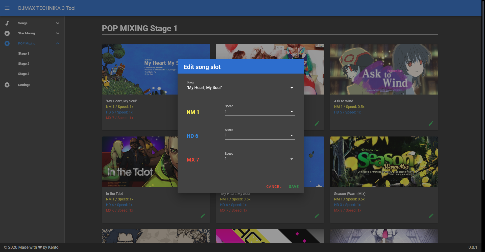

# DMT3-Tool
A tool to manage latest version of Programmed Crew DJMAX TECHNIKA 3 client.

## Features
1. Manage songs
2. Manage stages
3. Change note and coolbomb
4. Manage geame settings. (Fullscreen, show cursor, volume...etc)

## Usage
1. Install DMT3 mod patch from somewhere.
2. Download exe from [release page](https://github.com/rogeraabbccdd/DMT3-Tool/releases/latest).
3. Install.
4. Delete your `discstock.csv` and `<star/pop>_stage_<num>.csv` in your `gamepath/Resource/DiscInfo/`.  
   **THIS IS IMPORTANT, I HAVE FORMATTED SONGS LIST FILE!**
5. Open Settings, set your game folder and save.
6. You can edit your song solots in stages.
7. If you got **opreation not permitted** error when edit song slots, make sure your `<star/pop>_stage_<num>.csv` is not readonly.

## Build
1. Download repository.
2. Run `yarn`.
3. Run `yarn elec-serve` to run.
4. Run `yarn elec-build` to build.

## Change log
### 1.0
- Released.
### 1.0.1
- Fix init movie folder value when edit custom song.
### 1.1.0
- Add search feature in songs page and custom songs page.
- Add missing eyecatch.
- Delete custom songs.
- Also Check stages after edit songs, auto add and delete difficulties.
- Fix movie folder after edit official songs.
- Unlock PCrew Extra patterns in stages.
- Remove Creator MX in `discstock.csv`, pattern is same as HD.
### 1.2.0
- Change note skin.
- Check edited official songs data when reset stages.
- Add start game button in sidebar.
### 1.2.1
- Detect discstock limit when adding custom songs.
- Use unused disc id 88 and 178 as custom songs.
### 1.2.2
- Sort discstock after saving.
- Fix disc id detect when adding custom songs.